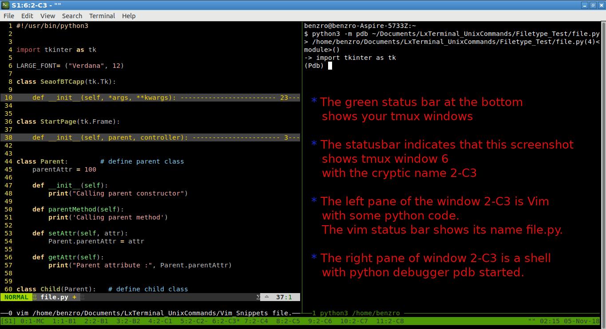
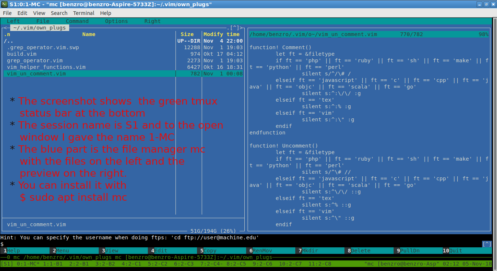

<h1 align="center"> qool-tmux-loop </h1>

## 💖 Welcome Dear Friend!
> You are visiting the qoolixiloop **tmux** repository. Please read on, if you like to find out, how you can profit from it.  
> Enjoy!  
> :sparkles:

### ⏳ TL;DR 
> This site is all about you, getting started with the terminal multiplexer **TMUX**, together with **VIM** and **.VIMRC**, a main component of your new IDE. If you like to find out, what tools and information I prepared for you, then please click on the button below.
>
> 

📖 read more...
> 

>  
> ⏳
>
> #### Word of advice 
> Tmux is a highly effective and stable terminal multiplexer, which allows you to open and split your windows within one single app. Tmux unfolds its maximum benefit, when it is used together with great terminal applications. If you are looking for a highly efficient IDE, I would suggest, you use it together with Vim, which provides you with an all in one, highly organised IDE, where you can develop your apps simultaneously in different languages and even pair-program. You can open dozens of windows, and within each window, another dozens of tabs with files you are working on simultaneously.  
> For that reason, I prepared two other repositories with Wiki pages, where you can download my [Vim][1401] together with my [.Vimrc][1501] configuration, which plays an important role in using and personalizing Vim. In a few minutes your new IDE will be up and running. But be warned, it may well be, you never want to leave your computer again.
>
> #### Why could you profit from the content of this repository?
> * Because you want to work simultanueously on different projects,  
but you prefer to have your open files highly organized.  
> * Maybe because you write your code in several computer languages,  
but you prefer one single development environment.  
> * Or perhaps because you want to start a pairprogramming session,  
but have no idea on how to do that.  
>
> Did you find anything?  
> Then please read on.  
>
> ⏳
>
> #### How qoolixiloop's repositories intend to make his friends productive
> * You will get my **Tmux Start-up Script** written in shell code.  
> This will start up a multi-window session in a split of a second. (You may of course adapt it to your individual needs. But be aware, that the script is sent as a one liner to your shell. Therefore, even small syntax errors like e.g. lagging spaces or even trying to comment the code will result in syntax errors.)  
> * You will get links to the pair programming tools **Tmate** and **Wemux**.  
> This will protect you from insecure solutions you may find on the internet.  
> * You will get links to a simple less secure pair programming solution.  
> This will give you an idea on how it works in principle, and how you could mess around with your own ssh server.
> * You will get the links to **TMUX** reference pages.  
> So you won't have to click through your web search engine's top ten search results to get your needed "How to".  
> * And last but not least, you will get links to my own Wiki pages, where I prepared a [Tmux Cheet-Sheet][1304] and instructions to start a [pair programming session][1303]. Furthermore, I added a Wiki page, in which I explain my [Tmux start-up script][1305].  
>
> Does this already sound like Christmas?  
> Then please read on.  
>
> ⏳
>    
> 

### 📸 Screenshots of tmux
> Please click the button below to see two screenshots, showing my IDE solution with Vim and Tmux. I added four bullet points in each picture, with a short explanation, what they are showing.
>
> 

 📖  read more... 
>
  
>
> 📸
>
> * 
>
> * 
>
> 📸
>
> 

### 🎁 Download my tmux start-up script
> The files are ready to be shared. Please click the button below to get download instructions.  
>
> 

> 
 📖  show the examples  
>  
  
>    
> 🎁
>
> 1. Go to your download folder (on Linux Ubuntu)  
>       **$ cd ~/Downloads**  
>
> 2. Clone the repository into your download folder   
>       **$ git clone https://github.com/qoolixiloop/qool-tmux-loop.git**  
>
> 3. Now you can move my script into your home directory.  
>       **$ mv src/tmux-startup $HOME/somefolder/**  
>
> That's it! In case you already have Tmux installed you are ready to go. To find out just open a shell and type:  
>       **$ which tmux**  
>
> You may now want to go to the next section, where you get instructions on how to [start up and use Tmux][50] and Vim.  
>
> 🎁
> 

### 📜 Instructions on how to use Tmux (and Vim)
> Please click the button below and you will see the instruction on how to install and run Tmux, Vim and Tmate . It's easy, just a few steps and you are ready to start writing your software like a multi-tasking genius.
>
> 

> 
 📖  show the instructions  
> 
  
>
> 📜
>
> * first, download tmux (on Ubuntu)  
>   **$ sudo apt install tmux**  
>
> * If you haven't done it already, you may now want to put my downloaded tmux startup script into a folder in your user home directory.  
>   **copy/paste to: ~/somefolder/tmux-startup**  
>
> * move to the directory myfolder  
>   **$ cd ~/somefolder/tmux-startup**  
>
> * run the script with your desired session name mySession. It doesn't matter just type a name, but do not forget the dot, to source the script.  
>   **$ . tmux-startup mySession**  
>   **$ ./tmux-startup mySession**              # in case you made the script executable  
>   **$ . ~/myfolder/tmux-startup mySession**   # in case you don't like the cd step  
>
> * now you can start additional teminal applications  
>   (you will already have some vim's)  
>   **$ vim**    # for another vim  
>   **$ mc**     # for another mc (if you don't have it: $ sudo apt install mc)  
>   **$ htop**   # if you need htop (if you don't have it: $ sudo apt install htop)  
>
> * to stop the tmux session go to any shell  
>   **$ tmux -ls**  
>   **$ tmux kill-session -t mySession**  
>
> * install additional tools on Linux Ubuntu with:  
>   **$ sudo apt install**  #after running ($ sudo apt update)  
>
> #### Useful tmux commands
> * if you are in a multipane window and want your pane to fill the whole screen you can toogle with the following key strokes  
>   **Ctrl-B z**  
>
> * in case you accidentally hit Ctrl-z and it shows your shell prompt, you can go back to the foreground by entering  
>   **$ fg**  
>
> #### Instruction using tmate (and tmux and vim)
> * download tmate (on Ubuntu)  
>   **$ sudo apt install tmate**  
>
> * That's it!  
>
> 📜
>  
> 

### 🌎 Links
> To share the links of web pages, which present their content in a clear and easy to read manner is one of the main objectives of my repositories. There is no need to reinvent the wheel, because most of the time there are already excellent resources out there, where the reader can find the needed information. But often, even with the help of one's preferred search engine, one ends up spending one's time with searching instead of working.  
> By clicking the button below you will see the links to official web sites. If you struggle with the many options which are described there, you may want to visit my Wiki pages. You will find the links to them at the end of the list.  
>
> 

> 
 📖  show the links  
> 
  
>
> 🌎
>
> | What the link provides | Link to website ('Ctrl-click' to open in new tab)
> |:---------------------------------------- | :----------------------------------------| 
> | `relevant links to websites:`            |
> | secure pair programming solution  | [tmate][1]  
> | secure pair programming solution  | [wemux][2]  
> | simple and less secure solutions  | [simple but less secure ssh solution tutorial][3]
> | simple and less secure solution   | [simple but less secure ssh solution][4]
> | `relavant links to my wiki pages:`        |
> | how my start-up script works              | [tmux start-up script][1305]
> | a list of useful commands and key strokes | [tmux cheet sheet][1304]
> | just enough to get you started            | [pair programming with tmate][1303]
>
> 🌎
>    
> 

### 🗄️ qoolixiloop's repositories
>
> By clicking the button below you will see a table with links to my 15 Code and 15 Wiki repositories as well as a short description of what is already or will soon be available. They cover a small subset of programming languages I learned during the last 20 or so years. The focus is mainly on free and open source tools within the linux operating system universe.  
> Because the learning curve for many of those tools and languages I used was steeper than necessary, I decided to provide some of my resources, references and examples, in order to help new learners better understand important topics.  
>
> 

> 
 📖  list of repositories  
> 
  
>
> 🗄️
>
> **Tmux and Vim as an IDE:** There are many good development environments availabe and some of them are quite expensive. Nevertheless or because of that, I mainly use Tmux and Vim as they are two very powerful terminal applications, which provide me with everything I need to write code efficiently. That being said, I must admit, that it is not easy to start with. That is why I shared my '.vim' folder and '.vimrc' configuration file, which both contain all the necessary instructions to download the plugins and run Vim within minutes as an IDE for example for Python, Java or Bash.  
>
> **Vim as a language:** Once I started programming with Vim, I immediately came into contact with Vim's own programming language, Vimscript. I even started to write my own little plugins and macros in Vimscript.  
>
> **Web Applications:** Google's Angular2 and the Springboot framework are part of the high demand trendy Java world. We used it at the University to build a multi-player online strategy game, which I intend to share as a tutorial. But that will certainly take some time.  
>
> **C**: Dennis Ritchie the father of Unix also developed C, which was in fact my first programming language. It is very low level compaired to newer languages, like Java or Python, many of which actually are implemented in C. It is clearly part of the low supply world, which means, that even though the language is still very useful for certain tasks, there are not many programmers left, that are able to understand it.  
>
> **Linux Tools:** Bash, SED and AWK are old, but still very powerful languages in the Unix/Linux command line world and even though the Linux kernel itself is written in C, many configuration scripts one may come across are written in Bash.  
> There is already a lot of very good advice about Bash programming available in thick books as well as in form of snippets scattered around specialized blogs and webpages. But it is still hard to get started with. That is why I decided to create a small framework inside a template script, whose code itself is checked by the shellcheck project. The template e.g. contains a few instructions, which make use of a concept used in Python to run the script from within a main() function, which is useful if the script is sourced or executed within another script in order to access its functions.  
> Furthermore, I provided an extensive example script, in which I cover nearly everything one needs to write stable and reliable scripts. I actually use it, to automate my communication with GitHub. It also lets me do changes on all my GitHub files automatically by providing pattern search and replace with SED, and it uses AWK to parse the script and to automatically print help and documentation text into the shell.  
>
> | Links to repositories ('Ctrl-click' to open in new tab)         | Contents
> |:-------------------------------| :----------------------------------------| 
> [qool-helloworld-loop][101]      | My personal project descriptons
> [qool-helloworld-loop.wiki][102] | More general topics
> [qool-angular2-loop][201]        | Client side code of strategy game
> [qool-angular2-loop.wiki][202]   | Comments and language specific resources
> [qool-awk-loop][301]             | Code snippets
> [qool-awk-loop.wiki][302]        | Comments and language specific resources
> [qool-bash-loop][401]            | Code snippets
> [qool-bash-loop.wiki][402]       | Comments and language specific resources
> [qool-c-loop][501]               | Code snippets
> [qool-c-loop.wiki][502]          | Comments and language specific resources
> [qool-cv-loop][601]              | My CV
> [qool-cv-loop.wiki][602]         | About me
> [qool-git-loop][701]             | Code snippets to automate tasks
> [qool-git-loop.wiki][702]        | Use cases and reference tables
> [qool-java-loop][801]            | Code snippets
> [qool-java-loop.wiki][802]       | Comments and language specific resources
> [qool-linux-loop][901]           | About Ubuntu installation
> [qool-linux-loop.wiki][902]      | About Ubuntu software center
> [qool-markdown-loop][1001]       | Folder with all my markdown files 
> [qool-markdown-loop.wiki][1002]  | Comments and language specific resources
> [qool-python-loop][1101]         | Code snippets
> [qool-python-loop.wiki][1102]    | Comments and language specific resources
> [qool-springboot-loop][1201]     | Server side code of strategy game
> [qool-springboot-loop.wiki][1202]| Comments and language specific resources
> [qool-tmux-loop][1301]           | IDE Startup shell script
> [qool-tmux-loop.wiki][1302]      | Comments
> [qool-vim loop][1401]            | My .vim folder and .vimrc file
> [qool-vim-loop.wiki][1402]       | Comments and language specific resources
> [qool-.vimrc-loop][1501]         | commented .vimrc file 
> [qool-.vimrc-loop.wiki][1502]    | how it works
>
> 🗄️
>  
> 

### 💻 About me
> My name is Roland Benz, I live in Zurich, Switzerland and decided to dedicate my time and knowledge to some projects on GitHub. By clicking the button below you will get all the necessary information with respect to hiring and donations.
>
> 

> 
 📖 show content about me  
> 

>
> :dizzy:
>
> ##### Hiring and Collaboration
> There is a [personal repository][602] dedicated to hiring and collaboration. If you are located in Switzerland this is the place, where you can find some sort of CV and contact information.
>
> ##### Donations 
> The qoolixiloop repositories will constantly be filled with great content. This service to the general public comes as a huge effort from my side. In case you are a wealthy person or an executive of a big organization, not knowing, where to invest all the money that is pouring in, there is hope on the horizon. Below you will find my lonely and empty bank account, grateful and happy about any kind of attention. 
>
> :dizzy:
>
> 

> 
 📖 show details for a bank transfer  
>  

>
> :dizzy:
>
> Details for a bank transfer to my account   
> Informations pour un virement bancaire sur mon compte   
> Detalles para una transferencia bancaria a mi cuenta   
> Angaben für eine Überweisungen auf mein Konto   
>
> | :dizzy:                  | Details / Information / Detalles / Angaben  
> | :--------------------------- | :--------------------------------------- |   
> BIC (SWIFT-Code) of my bank | POFICHBEXXX   
> BIC (SWIFT-Code) de ma banque | POFICHBEXXX   
> BIC (SWIFT-Code) de mi banco | POFICHBEXXX 
> BIC (SWIFT-Code) meiner Bank |	POFICHBEXXX   
> :dizzy: | :dizzy: |
> Name/Adresse of my bank |  PostFinance AG, Mingerstrasse 20, 3030 Bern, Switzerland   
> Nom et adresse de ma banque | PostFinance AG, Mingerstrasse 20, 3030 Bern, Suisse   
> Nombre y dirección de mi banco | PostFinance AG, Mingerstrasse 20, 3030 Bern, Suiza  
> Name/Adresse meiner Bank |  PostFinance AG, Mingerstrasse 20, 3030 Bern, Schweiz   
> :dizzy: | :dizzy: |
> My account number (IBAN)   |  CH08 0900 0000 8007 4635 1   
> Mon numéro de compte |  CH08 0900 0000 8007 4635 1   
> Mi número de cuenta |  CH08 9000 0000 8007 4635 1   
> Meine Kontonummer (IBAN)   |  CH08 0900 0000 8007 4635 1   
> :dizzy: | :dizzy: |
> My name and address | Roland Benz, Felsber 2, 8052 Zurich, Switzerland   
> Mon nom et adresse  | Roland Benz, Felsber 2, 8052 Zurich, Suisse   
> Mi nombre y dirección | Roland Benz, Felsberg 2, 8052 Zurich, Suiza   
> Mein Name und Adresse  | Roland Benz, Felsberg 2, 8052 Zürich, Schweiz	 
>
> :dizzy:  
>    
> 
  
>  
> 
  

  

------------------------
qoolixiloop, 10. Dec. 2018  

<!-- # (links only needed for 'qool-tmux-loop') -->

[1]: https://tmate.io/
[2]: https://github.com/zolrath/wemux
[3]: https://www.hamvocke.com/blog/remote-pair-programming-with-tmux/
[4]: https://gist.github.com/shrayasr/9778db8aabac59eba6b5
[50]: #-instructions-on-how-to-use-tmux-and-vim

<!-- # (github.com links of 'Code: README.md' and 'Wiki: Home.md') -->

[101]: https://github.com/qoolixiloop/qool-helloworld-loop "qool-helloworld-loop"
[102]: https://github.com/qoolixiloop/qool-helloworld-loop/wiki "qool-helloworld-loop.wiki"
[201]: https://github.com/qoolixiloop/qool-angular2-loop "qool-angular2-loop"
[202]: https://github.com/qoolixiloop/qool-angular2-loop/wiki "qool-angular2-loop.wiki"
[301]: https://github.com/qoolixiloop/qool-awk-loop "qool-awk-loop"
[302]: https://github.com/qoolixiloop/qool-awk-loop/wiki "wikiqool-awk-loop.wiki"
[401]: https://github.com/qoolixiloop/qool-bash-loop "qool-bash-loop"
[402]: https://github.com/qoolixiloop/qool-bash-loop/wiki "wikiqool-bash-loop.wiki"
[501]: https://github.com/qoolixiloop/qool-c-loop "qool-c-loop"
[502]: https://github.com/qoolixiloop/qool-c-loop/wiki "qool-c-loop/wiki"
[601]: https://github.com/qoolixiloop/qool-cv-loop "qool-cv-loop"
[602]: https://github.com/qoolixiloop/qool-cv-loop/wiki "qool-cv-loop/wiki"
[701]: https://github.com/qoolixiloop/qool-git-loop "qool-git-loop"
[702]: https://github.com/qoolixiloop/qool-git-loop/wiki "qool-git-loop/wiki"
[801]: https://github.com/qoolixiloop/qool-java-loop "qool-java-loop"
[802]: https://github.com/qoolixiloop/qool-java-loop/wiki "qool-java-loop/wiki"
[901]: https://github.com/qoolixiloop/qool-linux-loop "qool-linux-loop"
[902]: https://github.com/qoolixiloop/qool-linux-loop/wiki "qool-linux-loop/wiki"
[1001]: https://github.com/qoolixiloop/qool-markdown-loop "qool-markdown-loop"
[1002]: https://github.com/qoolixiloop/qool-markdown-loop/wiki "qool-markdown-loop/wiki"
[1101]: https://github.com/qoolixiloop/qool-python-loop "qool-python-loop"
[1102]: https://github.com/qoolixiloop/qool-python-loop/wiki "qool-python-loop/wiki"
[1201]: https://github.com/qoolixiloop/qool-springboot-loop "qool-springboot-loop"
[1202]: https://github.com/qoolixiloop/qool-springboot-loop/wiki "qool-springboot-loop/wiki"
[1301]: https://github.com/qoolixiloop/qool-tmux-loop "qool-tmux-loop"
[1302]: https://github.com/qoolixiloop/qool-tmux-loop/wiki "qool-tmux-loop/wiki"
[1401]: https://github.com/qoolixiloop/qool-vim-loop "qool-vim-loop"
[1402]: https://github.com/qoolixiloop/qool-vim-loop/wiki "qool-vim-loop/wiki"
[1501]: https://github.com/qoolixiloop/qool-.vimrc-loop "qool-.vimrc-loop"
[1502]: https://github.com/qoolixiloop/qool-.vimrc-loop/wiki "qool-.vimrc-loop/wiki"

<!-- # (github.com links of all other 'Wiki: pages.md') -->

[303]: https://github.com/qoolixiloop/qool-awk-loop/wiki/awk-cheet-sheet
[304]: https://github.com/qoolixiloop/qool-awk-loop/wiki/bash-script-with-awk-to-learn-from-example
[403]: https://github.com/qoolixiloop/qool-bash-loop/wiki/bash-script-to-learn-from-example
[404]: https://github.com/qoolixiloop/qool-bash-loop/wiki/bash-script-template
[405]: https://github.com/qoolixiloop/qool-bash-loop/wiki/bash-scripting-cheetsheet
[406]: https://github.com/qoolixiloop/qool-bash-loop/wiki/bash-scripting-reference-cards
[703]: https://github.com/qoolixiloop/qool-git-loop/wiki/a-.gitignore-template
[704]: https://github.com/qoolixiloop/qool-git-loop/wiki/commands-and-graphical-representation
[903]: https://github.com/qoolixiloop/qool-linux-loop/wiki/sed-in-a-nutshell
[904]: https://github.com/qoolixiloop/qool-linux-loop/wiki/bash-script-with-sed-to-learn-from-example
[905]: https://github.com/qoolixiloop/qool-linux-loop/wiki/grep-in-a-nutshell
[906]: https://github.com/qoolixiloop/qool-linux-loop/wiki/bash-script-with-grep-to-learn-from-example
[907]: https://github.com/qoolixiloop/qool-linux-loop/wiki/cut-in-a-nutshell
[1003]: https://github.com/qoolixiloop/qool-markdown-loop/wiki/browser-navigation-with-grip-running
[1004]: https://github.com/qoolixiloop/qool-markdown-loop/wiki/add-paypal-button
[1005]: https://github.com/qoolixiloop/qool-markdown-loop/wiki/add-images
[1303]: https://github.com/qoolixiloop/qool-tmux-loop/wiki/pair-programming-with-tmate
[1304]: https://github.com/qoolixiloop/qool-tmux-loop/wiki/tmux-cheet-sheet
[1305]: https://github.com/qoolixiloop/qool-tmux-loop/wiki/tmux-start-up-script
[1503]: https://github.com/qoolixiloop/qool-.vimrc-loop/wiki/My-.vimrc-configruation-file-explained-in-detail

